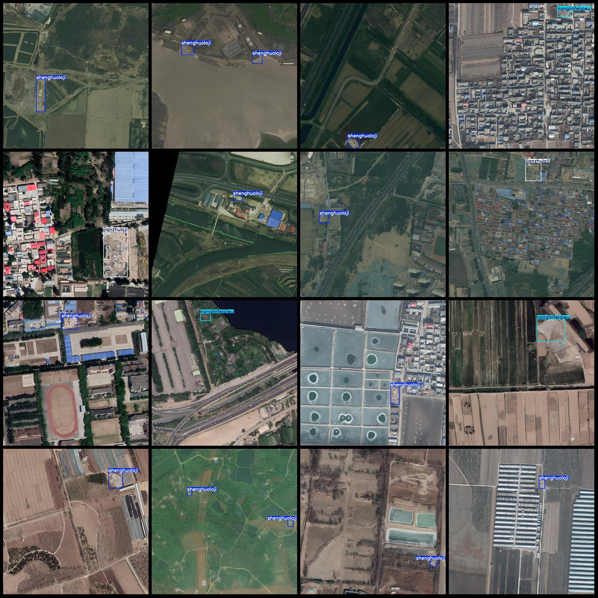
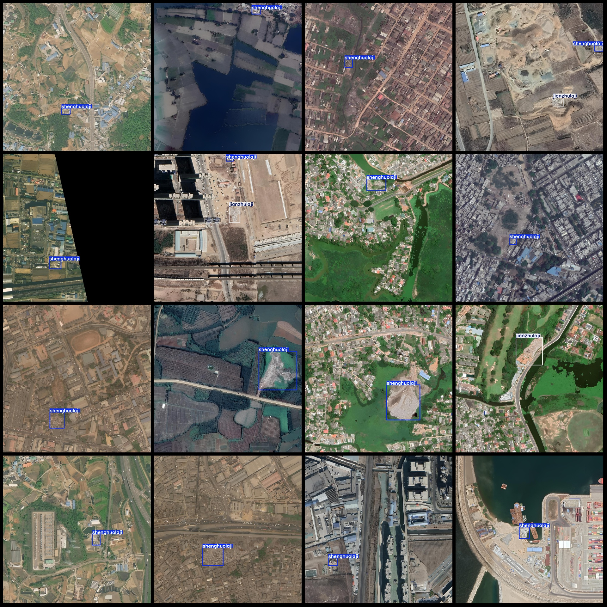

# UAV Perspective City Waste Industrial Area Waste Disposal Detection Dataset (VOC+YOLO Format, 3385 Images, 6 Classes)

**Dataset Format:** Pascal VOC format + YOLO format (txt file without segmentation paths, only containing jpg images and corresponding VOC format xml files and YOLO format txt files)

- **Image Count (jpg Files):** 3385
- **Annotation Count (xml Files):** 3385
- **Annotation Count (txt Files):** 3385
- **Number of Classes:** 6

**Annotation Categories:** [gongyefeiqiwu, jianzhulaji, kuangcaifeiqiwu, nonglinfeiqiwu, shenghuolaji, yichulaji]

**Box Count for Each Category:**
- Gongyefeiqiwu (Industrial Waste) Boxes = 1, Occupies Image Count = 1
- Jianzhulaji (Construction Waste) Boxes = 707, Occupies Image Count = 631
- Kuangcaifeiqiwu (Mineral Processing Waste) Boxes = 1, Occupies Image Count = 1
- Nonglinfeiqiwu (Agricultural and Forestry Waste) Boxes = 389, Occupies Image Count = 361
- Shenghuolaji (Household Waste) Boxes = 2936, Occupies Image Count = 2599
- Yichulaji (Processed Waste) Boxes = 12, Occupies Image Count = 10

**Total Boxes:** 4046

**Image Resolution:** 1280x1280

**Annotation Tool:** labelImg

**Annotation Rules:** Draw a box around the category.

**Important Notes:** The dataset does not have been split into training, validation, and test sets; you need to do that yourself.

**Special Remarks:** This dataset does not guarantee any accuracy in the trained models or weight files.

**Image Preview:**

## Images

Here is a pay link on Stripe ( https://buy.stripe.com/3cs8yP7sY87d0vu9AB ). Please contact me lonlonago@foxmail.com after funding $89, and I will send you a complete data files , thank you!

